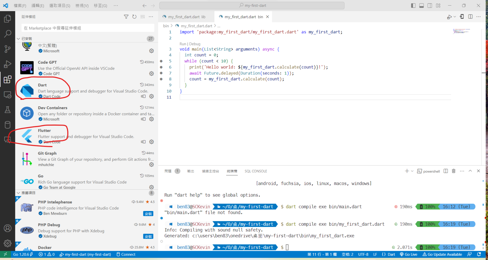
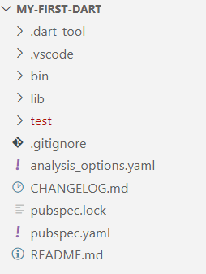

#程式語言教學與技術文件 #Google派系 #Flutter #Dart #Dart基本概念
# 如何建立一個Dart Console專案

Flutter只是一個跨平台框架，他的程式語言主要是由Dart去做主要開發語言，但<span class="red-text font-bold">老實說Dart就是為Flutter而生的，沒有Flutter就沒有Dart</span>，雖然最後Dart可以被獨立在Flutter之外，<u>但Dart獨立出去可以做的事情卻是少之又少</u>，不過只要可以製作Console的工具，就可以為Flutter的開發作預先的練習與準備，畢竟Dart的專案不需要考慮到前端的UI/UX跟GUI，可以專注在程式的邏輯上面。也對未來Flutter在建立MVVM當中，開發Modal資料區域(非介面)有很大的幫助。

## 如何安裝Dart?

如果要安裝Dart，最快的方式當然是直接安裝Flutter，因為Flutter框架是建立在Dart的，所以一定會安裝Dart，安裝Flutter可以參考Flutter的安裝教學。如果要獨立安裝Dart也可以，以下是安裝SDK的步驟：

1.  前往 [Dart SDK 的官方網頁](https://dart.dev/tools/sdk/archive)。
2.  選擇你電腦作業系統平台下在Dart SDK的下載程式，這邊的例子是用Windows-x64
3.  安裝SDK
4.  安裝完畢後，找到Dart SDK的bin資料夾，把它放到作業系統的環境變數中，使其讓終端機辨認到dart
5.  設定好了，打開終端機並輸入 dart —version 檢查Dart的版本，如果能順利執行，就代表Dart的安裝前置作業已經完成。  
&nbsp;
    <span class="red-text">**注意：如果未來要用Flutter來做為主要的開發工具，建議就直接裝Flutter了，不要Dart跟Flutter分開安裝比較好，這樣也方便管理**</span>

## Dart與Flutter的IDE — Android Studio或Visual Studio Code

Dart與Flutter都是Google 旗下的程式語言，又主打可以跨平台開發Windows/MacOS/Linux/iOS/Android/Web的狀態下，<u>**主打的IDE一定是Google唯一主導開發的IDE—Android Studio**</u>，不過目前是還沒有用Android Studio開發過Dart，只有用Android Studio開發過Flutter，所以Android Studio的部分，就先留給Flutter去說。<font class="red-text">而我們目前使用的IDE，就是號稱地表最強的文字編輯器— Visual Studio Code。</font>

Visual Studio Code 是微軟旗下的跨平台文字編輯器，有豐富的擴充套件可以做應用，強大的程度不單單可以做比對軟體，開發C#、PHP、css、HTML、Javascript跟Golang這些許多的程式語言大多也是不在話下的，一般來說只要這個程式語言可以用終端機去下指令開發的，或是可以用瀏覽器直接執行除錯的，Visual Studio Code他都能幫你開發。所以當然Dart/Flutter也是可以順利用Visual Studio Code做開發，在Flutter中不只可以除錯，甚至還能幫你開Android/iOS模擬器，完全代替Android Studio在Flutter當中的作用，習慣Visual Studio開發風格的不妨可以試試。

### 如何把Visual Studio Code 設定成可以開發Dart/Flutter的IDE

要讓Viusal Studio Code變成IDE很簡單，只要安裝Flutter跟Dart的擴充套件就可以了，如下圖所示：




如果你還需要一些排版或等等之類的擴充套件，就可以依照自己的需求去安裝設定。

## 建立你的第一個Dart Console 專案

要建立一個Dart Console專案其實非常簡單，在你要放專案的資料夾下開啟終端機，並輸入以下指令：

```bash
dart create -t console <你的專案名稱>
```

這樣他就會在你的資料夾下建立一個為你設定好專案名稱的dart專案資料夾了，接下來只要進去這個專案資料夾後以Visual Studio Code來開啟這個資料夾，就可以開始開發Dart了。

## Dart專案的資料夾架構



Dart的資料夾架構跟Flutter其實長得非常非常的像(就像上面說的，Dart是為Flutter生的)，但大致上可以依照這個去看一個Flutter/Dart的資料夾架構，差異在於Flutter多了個平台的資料夾如web/windows/android/ios，以及編譯出native APP的build資料夾外，大多與Dart的資料夾架構相差無異，下面是Dart資料夾架構的介紹，我會在當中寫出Flutter與Dart資料夾架構中的差異，如果沒有，就是相同。

- .dart_tool：大概是Dart編譯時的檔案，是必要的，但我們完全不會碰到它
- .vscode： Visual Studio Code的編譯/除錯的設定資料，只要你在VSCode除錯一次，就會有這個資料夾
- bin：Dart的主要程式碼檔案區，裡面有主程式的dart檔案，程式碼就是在這裡寫的，關於Dart把檔案匯出成exe檔，執行檔也會被存在這裡，注意的是，<font class="red-text">Flutter沒有這個資料夾。</font>
- lib：Dart的副程式碼區域，如果你有其他要擴充的dart程式碼要加入主程式，可以放在這裡，就是一個library的概念。<font class="red-text">但因為Flutter沒有bin這個資料夾，所以在Flutter當中的lib不只充當library，也是主要程式碼開發的地方。</font>
- test：這邊是存放測試程式碼的地方，例如整體測試、自動化測試、功能測試、單元測試等等，也可以做新功能的測試。當你需要測試時，就在程式碼中引用他們，以確保他們不會影響到正式程式的運作，當然，這個地方只要不引用，就不會有編譯錯誤的問題。
- analysis_options.yaml：主要用於定義Flutter專案的靜態分析規則，可以自定義規則，例如定義程式碼風格、錯誤提示和建議等等。它的主要目的是提高程式碼的可讀性和可維護性，並減少錯誤和臭蟲的出現機率。但應該是不會去使用到這個，除非有特殊情況。

接下來我們可以來看這個新建的初始Dart專案了，我們先用Visaul Studio Code打開這個專案資料夾，並打開專案中bin當中唯一的dart檔，一般檔名會跟你的專案名稱相同如下，一般來說預設的程式碼會是長這樣：

```dart
import 'package:my_first_dart/my_first_dart.dart' as my_first_dart;

void main(List<String> arguments) {
  print('Hello world: ${my_first_dart.calculate()}!');
}
```

這就是這個專案的主程式，我簡單用Code說明一下Dart的程式最簡單的基本架構：

```dart
import 'package:my_first_dart/my_first_dart.dart' as my_first_dart;
//這邊就是引用某個dart

//主程式
void main(List<String> arguments) {
  print('Hello world: ${my_first_dart.calculate()}!');
	//這邊是顯示Hello World跟calculate計算出來的參數，print就跟一般C語言一樣，就是顯示。
}
```

如上面所寫的，你會發現 my_first_dart.calulate() 在這個主程式碼是找不到的，那這個原始碼的位置在哪裡呢?這個程式碼就會放在專案資料夾的lib中。你會發現lib裡面也有一個跟這個檔案一模一樣名稱的dart檔，這就是這個主程式的library。而你也會了解上方的import，就是讓主程式可以導入libarary的方式，下面可以這樣說明：

```dart
import 'package:my_first_dart/my_first_dart.dart' as my_first_dart;
=> 'package:my_first_dart/my_first_dart.dart'是library的指定點，也就是/lib/my_first_dart.dart
=>  as my_first_dart => 給這個引用一個後綴，讓他可以用這個名稱來讓他限定使用這個lib
```

接下來我們來看/lib/my_first_dart.dat：

```dart
int calculate() {
  return 6 * 7;
}
```

這個函式非常簡單，就是回傳6*7，也就是42，以int的方式回傳出去。

依照剛剛所有程式碼的說明，執行應該要長這個樣子：

```bash
Hello world: 42!
```

下一章節會說明怎麼在Visual Studio Code針對Dart去做Debug跟Compile來顯示上方的結果。