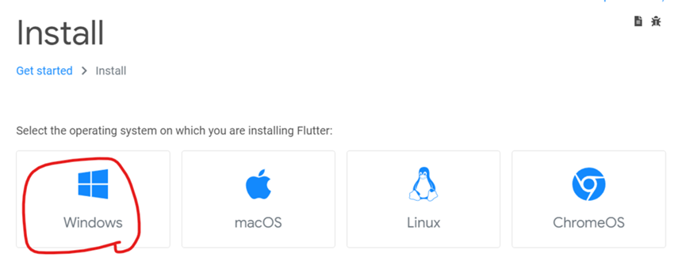
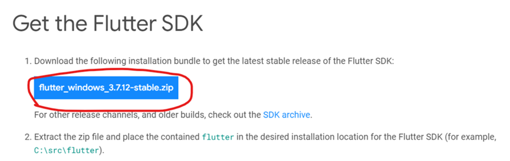
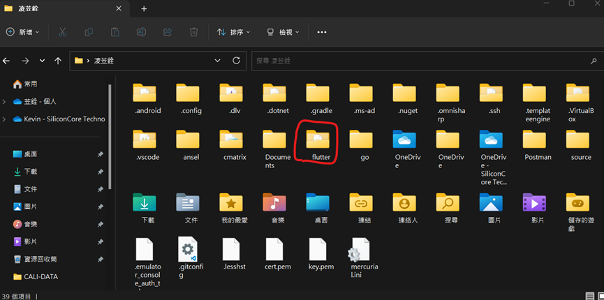
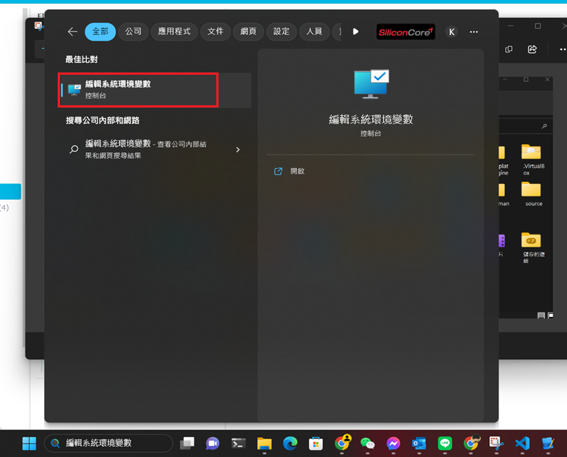
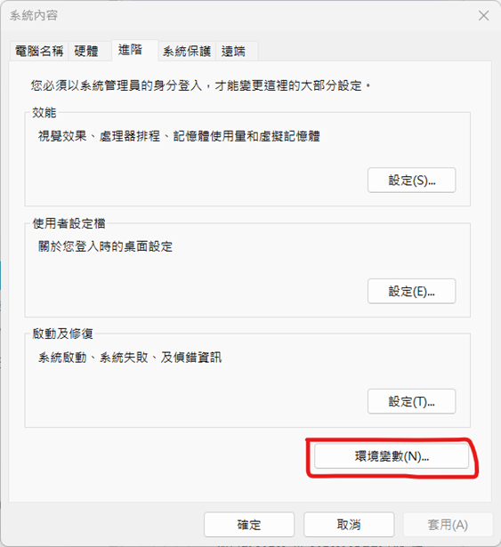
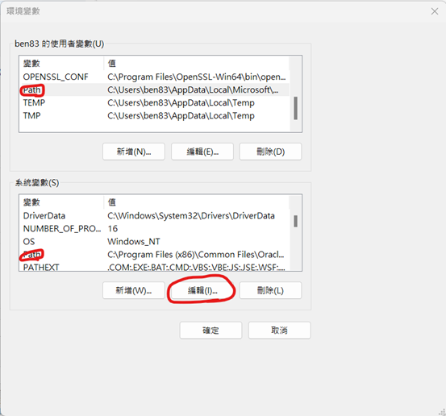
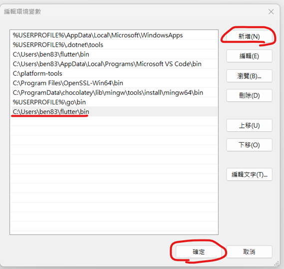
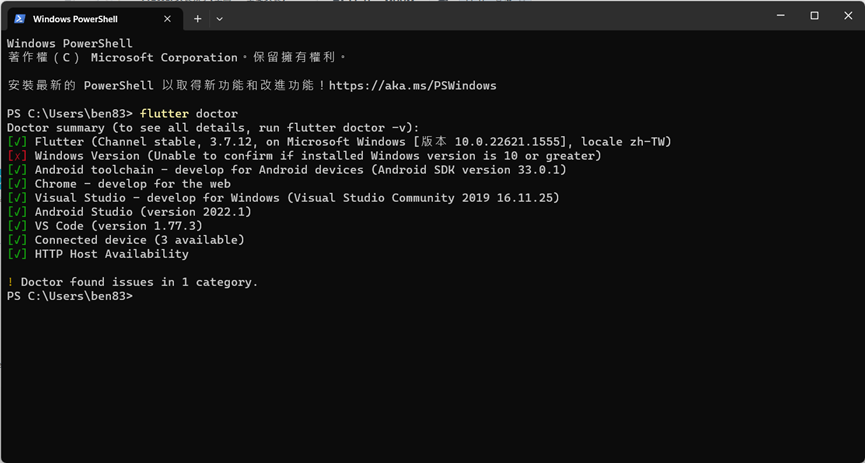

#程式語言教學與技術文件 #Google派系 #Flutter #Flutter基本教學
# Flutter安裝教學(上篇 -- 基礎安裝)

要在Windows安裝Flutter其實並不困難，比較難的大多著重在各平台編譯器的整合，接下來讓我們一步一步來安裝。
1.  首先先至官網下載Flutter的安裝包：https://docs.flutter.dev/get-started/install
2.  選擇你的平台，這邊是以Windows為主，所以點選Windows下載Windows Flutter的原始包。






3. 下載完之後，先講壓縮檔解壓縮，接下來將解壓縮的資料夾移動到用戶的跟資料夾就像這樣



4. 接下來我們要來設定Windows所謂的環境變數，來讓Power Shell與CMD可以直接使用flutter的指令。
5. 在Windows 10/11開始工作列下方的搜尋上打上「編輯系統環境變數」，點選他後就會出現。當然還有用電腦內容、電腦設定等地方去做開啟，對其他方式有興趣的可以查找Google了解。



6. 接下來會出現這個視窗，點選環境變數。



7.會出現新的編輯環境變數視窗，在使用者跟系統中找到Path，並按下編輯。



8. 接下來會進入新的清單頁，按下新增，並將flutter執行檔的資料夾加入清單後，按下確定，連同原本環境變數的視窗也都按下確定作全部的設定儲存。
<font class="red-text">Flutter的執行檔資料夾路徑："&lt;資料夾解壓縮的跟資料夾路徑&gt;\flutter\bin"</font>



9. 接下來就打開PowerShell(或是CMD、Windows11的Windows Terminal)，嘗試執行以下命令，應該會出現類似這樣的顯示，出現了就算初步安裝成功。

```bash
flutter doctor
```



下一篇會說明flutter doctor的用處，如何完成這些勾勾，把周圍環境建起來。