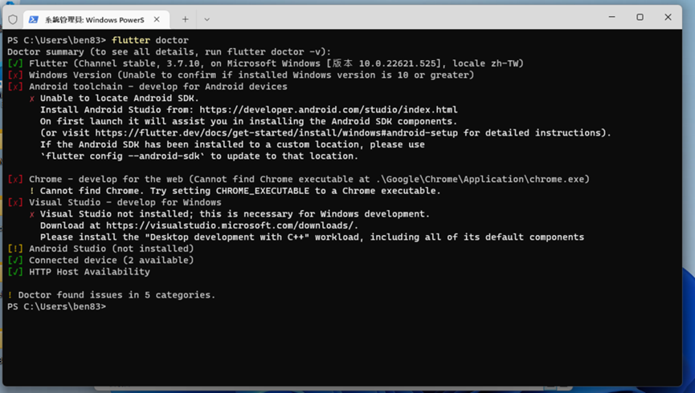

#程式語言教學與技術文件 #Google派系 #Flutter #Flutter基本教學
# Flutter安裝教學(下篇 -- 跨平台編譯環境初始檢測)

Flutter是一個跨平台的程式套件，內部的程式語言使用的則是Google開發的Dart，既然是跨平台，就必須配合不同平台的編譯器去建置特定平台的程式，所以安裝後並不能順利去做使用，必須將所有的編譯環境建設好之後才能搭配Flutter去做開發，Flutter為了方便使用者去做環境檢測，就做了一個檢測的指令，就是上篇最後說到的 -- flutter doctor。

一般當你沒有安裝任何的編譯環境、SDK時，正常來說到終端機執行Doctor時，應該會是長這樣：

沒錯，一堆錯誤跟警告，現在先一一簡單說Flutter Doctor所檢測的有那些：

- Flutter：就是Flutter這個套件的安裝是否正常，一般都會是綠色的，也是裡面初始時就會是綠色勾勾的東西。
- Windows Version：Flutter能開發Windows桌面程式，所以也會檢測.NET的開發環境，一般來說只要把Visual Studio的桌面開發環境裝好，這裡就會是綠色的，不過還是會有例外。
- Android：Flutter也可以開發Android，所以也會檢測Android Studio的狀況，一般者這裡的問題只要照指示去Android Studio處理即可，除了License要搭配指令去做，
- Connect Device：目前這邊是沒有使用到，大部分都是綠色的，一般不會有什麼問題。
- HTTP Host：Flutter 也可以開發Web，所以也會檢測Web環境，一般來說這個一開始也都會是綠的。
- Xcode：Flutter能開發iOS跟MacOS的桌面程式，他也會檢測相關功能，MacOS那邊會用到Cocoa這個模組套件與iOS的相關套件(simulator之類的)，不過因為身邊沒有Mac，所以不多贅述。
- Linux : 沒錯，Flutter也可以寫Linux的桌面程式，一般會告訴你要安裝什麼套件這個才會是綠色的，但Linux桌面程式也不常開發，所以這邊也不多贅述。

上面的截圖應該沒有下方說明得這麼多，因為再Windows當中不會檢測Xcode跟Linux， Linux當中不會檢測Xcode跟Windows，MacOS當中不會檢測Linux跟Windows，其他的像Web跟Android，就是所有平台都會檢測的東西了，

那麼遇到這些東西要怎麼解決呢?簡單寫出一些預設的問題與解決方案，如果有其他的，可以再增加。

- **Windows Version (Unable to confirm if installed Windows version is 10 or greater)**：這個只要有裝好Visual Studio，一般可以不用理他，即使是紅色X也沒關係。
- **Android Studio(not installed)**：去安裝Android Studio
- **Chrome - develop for the web**：去安裝Google Chrome
- **Android toolchain -- cmdline-tools component is missing** : 去Android Studio 的 「SDK Manager」安裝 「Android SDK Command-line Tool」即可解決。
- **Android toolchain -- Some Android licenses not accepted**.：依照指示執行「flutter doctor --android-licenses」並同意所有合約就可以解決。

doctor的用意就是要把每個環境都設定好，才可以在開發時無後顧之憂的編譯任何平台，所以盡量能都是綠色的就盡量完成，但如果真的很緊急需要開發，那至少把當前你要開發的平台部分處理好。