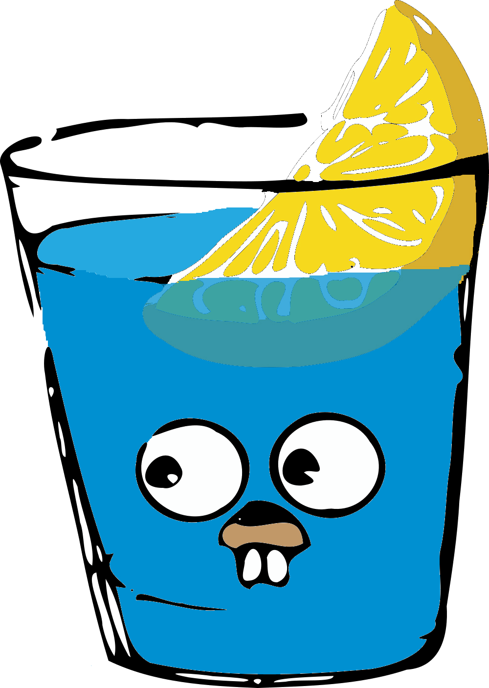

#程式語言教學與技術文件 #Google派系 #Golang #Golang進階技巧
# Gin -- Golang的伺服器框架

## 初步介紹：原生的net/http

Golang他自己也是有自己的服務框架的，而且他不需要像PHP要有一個代理伺服器，他可以自己開Port自己跑，這個就是原生的net/http，想了解可以看Golang基本學識的這個部分：

[Golang基本學識 -- http GET POST](../../../../程式語言教學與技術文件/Google派系/Golang/Golang%20基本學識/24.%20http%20GET%20POST.md)

## Gin -Go的伺服器框架

Gin(琴酒)是Golang中最為有名的Golang伺服器框架，大多的後端開發者都是仰賴Gin來建立他的伺服器後端，這是他的Logo：

他能夠更方便的管理伺服器的各種安全與API的狀況，也能更好的去輸出他的Log，是非常方便的東西，接下來會開始說明**後端的文件之寶--Swagger**，Gin的相關基本實力會在這個部分開始說明。