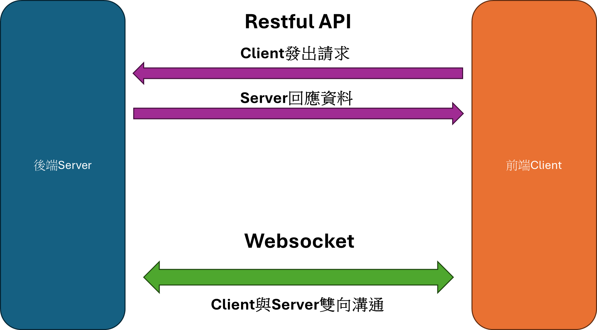
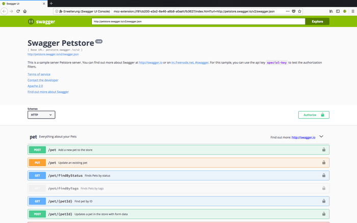

#程式語言教學與技術文件 #Google派系 #Golang #Golang進階技巧 #後端工具
# 後端文件之寶-Swagger

## 什麼是Swagger?

Swagger 是一種後端格式的文件編寫網頁軟體，後端與前端常常需要戶相連接，而後端就是一種Restful API的Sever，前端則是Restful API的Client，可以用這樣的圖來理解：

而這時候，雙方溝通的橋樑有時是參數，有時不是，最常見的就是Json格式，這時候雙方有沒有一個通訊的基本格式與協定就非常重要了，但如果用文件來寫會變得非常麻煩，因為還需要空出時間寫才可以，這個時候Swagger就會起到非常大的作用，因為它可以在開發人員開發程式時，順便將後端的文件給建構出來，協助前後端溝通的協調，這是他的基本畫面。

你可以從當中看到，他可以根據你的資安方式去做驗證，並且下方有很多的POST、GET、PATCH、PUT、DELETE等API協定的格式文件，這會讓整個通訊的格式都清晰很多減少溝通成本，這樣你就知道為什麼他非常重要了。接下來，我們將會來看看Golang是如何實現Swagger的製作。