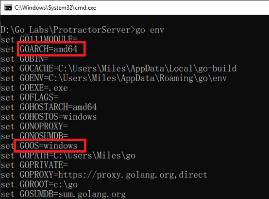

#程式語言教學與技術文件 #Google派系 #Golang #Golang的一些特別概念跟技巧
# Golang 跨平台編譯

Golang可以做跨平台編譯，即使是Windows也可以編譯MacOS、Linux的檔案，在這之前，先使用此指令來檢查一下環境參數：

\=> go env

大致上會看到這些東西：

在這邊，我們只要注意 GOARCH、GOOS、GOARM其實就可以了，其他設置可以之後需要用到的時候再來查詢參考

GOARCH：GO 需要編譯的CPU平台是什麼(386/amd64/arm/arm64)

GOOS：GO需要編譯的OS平台是什麼?(Windows/Linux/MacOS)

GOARM：ARM 32位元的CPU架構版本是多少 (如果是Armv7就寫7，以此類推，如果是Intel架構或是Arm64就不用寫)

設定好這三個後就直接build就好了!以下是設定的方法：

- SET GOOS=linux (這是單次儲存，一旦build或是關閉視窗就會回到預設值)
- go env -w GOOS=linux (這是永久儲存，之後都會用這個設定做建置)

&nbsp;

遇到的坑與建議：

- 如果只是要單次寫入不儲存的話，Windows要用cmd，用powershell可是會沒用的