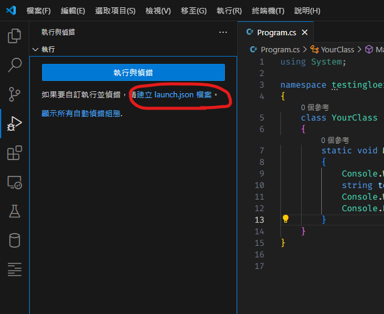
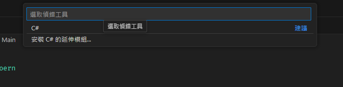
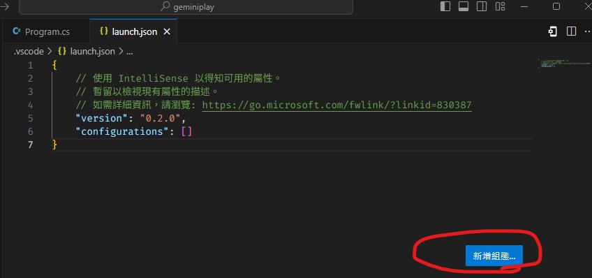
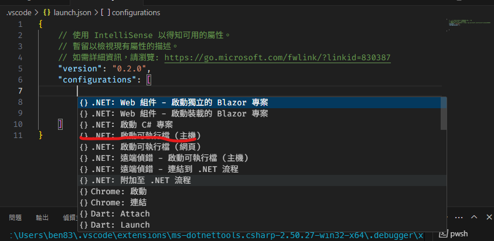

#程式語言教學與技術文件 #Microsoft派系 #CSharp #VSCode
# 如何利用VSCode寫Console

一般來說VSCode之所以可以除錯，往往得益於擴充套件的幫助，以及VScode核心的除錯設定檔 -- **launch.json** ，可以依據其設定來設定我們除厝時要做那些前置作業，要找哪個Compile來做，或是說要調整其參數與設定檔，以下可以提供C#跟Flutter的設定檔看：

### C#

```json

{
	// 使用 IntelliSense 以得知可用的屬性。
	// 暫留以檢視現有屬性的描述。
	// 如需詳細資訊，請瀏覽:    		https://go.microsoft.com/fwlink/?linkid=830387
	"version": "0.2.0",
	"configurations": [
		{
			"name": ".NET Core Launch (console)",
			"type": "coreclr",
			"request": "launch",
			"program": "${workspaceFolder}/bin/Debug/net6.0/geminiplay.exe",
			"args": [],
			"cwd": "${workspaceFolder}",
			"stopAtEntry": false,
			"console": "integratedTerminal"
		}
	]
}

```

### Dart(Flutter)
```json
{
	// 使用 IntelliSense 以得知可用的屬性。
	// 暫留以檢視現有屬性的描述。
	// 如需詳細資訊，請瀏覽: https://go.microsoft.com/fwlink/?linkid=830387
	"version": "0.2.0",
	"configurations": [
		{
            "name": "my-first-dart",
            "request": "launch",
            "type": "dart",
            "console":"terminal"
        }
    ]
}
```

一般來說，這種設定檔的初始參數與樣式都會是擴充套件會幫你做好，以前的C#也是如此，<font  color="red-text">但現在是越來越難做了</font>，所以特別寫此筆記幫助C#開發者來自己處理。

## 建立launch.json
要建立json的話，可以先到除錯的地方，按下「建立json檔案」


接下來，會跑出你要選擇的語言套件，就選C#。



之後就會幫忙建立一個空白的launch.json的文件如下。這時要去新增組態。



接下來會看到很多組態，就找你要的專案，例如我現在要做的是Console專案，那就選擇Console。



好了之後就會出現以下組態了：
```json
{
    // 使用 IntelliSense 以得知可用的屬性。
    // 暫留以檢視現有屬性的描述。
    // 如需詳細資訊，請瀏覽: https://go.microsoft.com/fwlink/?linkid=830387
    "version": "0.2.0",
    "configurations": [
        {
            "name": ".NET Core Launch (console)",
            "type": "coreclr",
            "request": "launch",
            "preLaunchTask": "build",
            "program": "${workspaceFolder}/bin/Debug/<target-framework>/<project-name.dll>",
            "args": [],
            "cwd": "${workspaceFolder}",
            "stopAtEntry": false,
            "console": "internalConsole"
        }


    ]
}

```

接下來我會一一講解一些可能會常用到的東西。

* **preLaunchTask**：這個主要是在編譯前的前置作業，如果沒有特別要去做使用的話，就不用特別去動，固定為build，這個是需要再建立一個tasks.json做設定的，如果要用到之後再來寫筆記。
*  **args**：這是參數相關，可以再你編譯的時候加入參數，例如dart他就需要新增一洩html渲染參數來達到我要的編譯設定。
*   **console** ： 決定偵錯時你是要開外部終端、內部終端還是要偵錯主控台，這應該是最常用的參數了
*   **program**：這是除錯程式的位置，會在個階段說明怎麼去寫他

## 設定 Program
之前一直無法順利除錯就是program的問題。其實這個Program就是你除錯編譯後的主程式，他預設是長這樣的：

```json
"program": "${workspaceFolder}/bin/Debug/<target-framework>/<project-name.dll>",
```

但這邊其是是要你自己填入sdk跟執行檔的名稱內容的，也就是**target-framwork**跟**project-name.dll**。

* **target-framwork**：SDK的名稱，一般來說VSCode只能編譯.net core的東西，所以這個資料夾會依據你是.net core的哪個版本去跑，名字大多為".net x.x"，例如6.0就會是net6.0，8.0就會是net8.0，這就看你指定的SDK是誰了(記住沒有「.」)
*  **project-name.dll**：這個就是你的執行檔了，往往都是專案名+副檔名，像我的這次做的是Console，所以應該要是exe檔案，正確的名稱應該為<專案>.exe

最後來看正確的寫法：
```json
{
  // 使用 IntelliSense 以得知可用的屬性。
  // 暫留以檢視現有屬性的描述。
  // 如需詳細資訊，請瀏覽: https://go.microsoft.com/fwlink/?linkid=830387
  "version": "0.2.0",
  "configurations": [
    {
      "name": ".NET Core Launch (console)",
      "type": "coreclr",
      "request": "launch",
      "preLaunchTask": "dotnet: build",
      "program": "${workspaceFolder}/bin/Debug/net8.0/geminiplay.exe",
      "args": [],
      "cwd": "${workspaceFolder}",
      "stopAtEntry": false,
      "console": "integratedTerminal"
    }
  ]
}

```

在這裡面就可以知道，我的專案名稱是genimiplay，我使用的是.net 6.0，執行檔是geminiplay.exe，是一個Console執行檔，而我的console使用的是內部終端而不是偵錯主控台

這樣就可以偵錯了，如果不知道你的內容，可以先donet run一次看看，因為跑完這些執行檔的路徑跟名稱就會知道了，再寫進去就好了喔~

## 同場加映：修改使用的.NET

如果你的電腦有兩個.net再使用(6.0跟8.0)，那也可以轉換，只要在**專案名稱.csproj**還有剛剛說的**launch.json**這兩個地方改掉就可以了

### csproj
```
<Project Sdk="Microsoft.NET.Sdk">

  <PropertyGroup>
    <OutputType>Exe</OutputType>
    <TargetFramework>net8.0</TargetFramework> -> 這個地方改成你要的版本
    <ImplicitUsings>enable</ImplicitUsings>
    <Nullable>enable</Nullable>
  </PropertyGroup>

</Project>

```

### launch.json
```json

{
  // 使用 IntelliSense 以得知可用的屬性。
  // 暫留以檢視現有屬性的描述。
  // 如需詳細資訊，請瀏覽: https://go.microsoft.com/fwlink/?linkid=830387
  "version": "0.2.0",
  "configurations": [
    {
      "name": ".NET Core Launch (console)",
      "type": "coreclr",
      "request": "launch",
      "preLaunchTask": "dotnet: build",
      "program": "${workspaceFolder}/bin/Debug/net8.0/geminiplay.exe", //這裡改成你那個版本的資料夾
      "args": [],
      "cwd": "${workspaceFolder}",
      "stopAtEntry": false,
      "console": "integratedTerminal"
    }
  ]
}
```