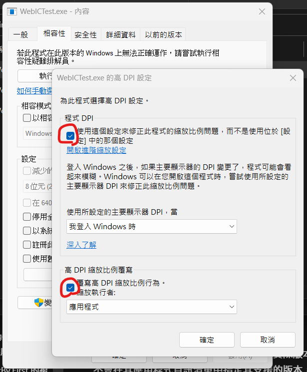

#程式語言教學與技術文件 #Microsoft派系 #CSharp
# C# WinForm/WPF 自動調整DPI

無論是WinForm、WPF，只要你是傳統Desktop的程式，就一定會遇到高DPI的程式自動調整，當然也可以不用到這麼麻煩，使用前進執行檔內容修改這兩個東西就可以：




但要知道這樣的方式有時候是不太好的，因為程式大多都是設計在縮放大小為100%的狀況下，一打開就模糊難免造成使用者的不舒服，所以我們要在程式碼增加以下部分，讓程式打開時就順應當下主螢幕的縮放大小去做調整，這樣每次打開就都會是清晰正常的視窗了。

以下是WinForm當中主要開啟程式的 Program.cs：

```csharp
using System;
using System.Collections.Generic;
using System.Linq;
using System.Threading.Tasks;
using System.Windows.Forms;
using System.Runtime.InteropServices;

namespace WebICTest
{
    static class Program
    {
        /// <summary>
        /// 應用程式的主要進入點。
        /// </summary>
        [STAThread]
        static void Main()
        {
            //自動修改DPI
            if (Environment.OSVersion.Version.Major >= 6)
            {
                SetProcessDPIAware();
            }
            Application.EnableVisualStyles();
            Application.SetCompatibleTextRenderingDefault(false);
            Application.Run(new Form1());
        }

        //高DPI自動設置(可以不用管)
        [DllImport("user32.dll")]
        public static extern bool SetProcessDPIAware();
    }
}
```

程式當中可以看到，我們運用了Win32的user32.dll中名為「SetProcessDPIAware」的函式，來協助我們自動調整DPI，並且運用Enviroment的OSVersion來判斷系統版本，確定支援這個功能後來開啟自動調整DPI，是不是很簡單?

不過使用後會發現，當自動調整DPI之後，把程式移到DPI較低的地方，他依舊會模糊，相反的，用上述修改內容的方式，不會模糊，反而變大。

但其實大多數的程式自動修改DPI之後會出現低DPI有模糊的這個狀況其實都是十分正常的，所以不必擔心，反而沒有做自動DPI，一開場就模糊才是痛點