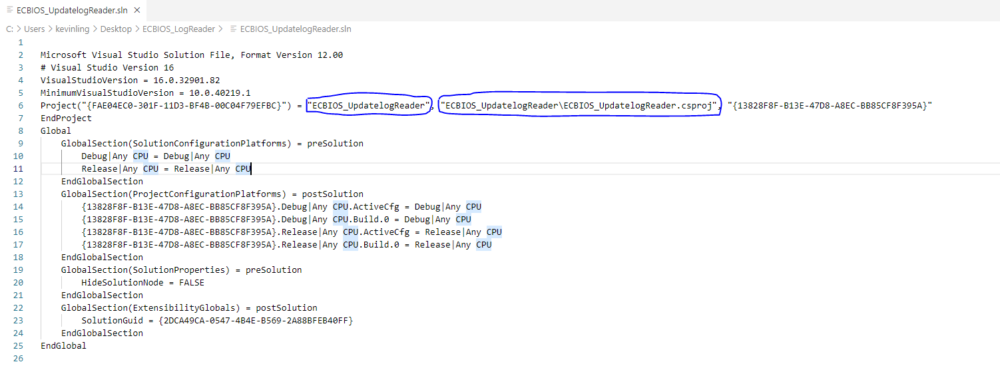
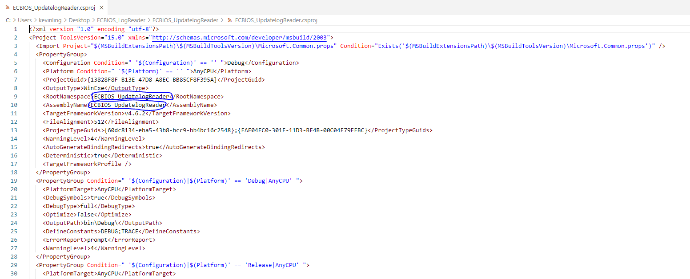

#程式語言教學與技術文件 #Microsoft派系 #CSharp #VisualStudio
# 如何改專案名稱

Visual Studio要改專案名稱其實非常麻煩，目前只給予Winform和WPF的更改專案方式，至於MAUI和Xamarin如有機會遇到會再寫進去

1. 編輯專案檔(.sln)，之後修改專案檔中的專案名稱與專案檔路徑如下：

2. 接下來，修改sln的名稱與資料夾的名稱為你剛剛的新專案名稱。
3. 進入專案資料夾，會看到如<專案名稱.csproj>這樣的檔案，請先打開。
4. 進入csproj檔案後，修改下面兩個位置為新專案名稱如下：

5. 修改後儲存，再把原本的csproj重新命名成<新專案名稱.csproj>。
6. 把專案內的obj和bin殺掉
7. 回到上個資料夾，用Visual Studio打開sln檔(開啟專案)
8. 進入Visual Studio後，找主要cs檔打開，並按下在「專案中取代」的快捷鍵(Ctrl+Shift+H)，會出現新的小視窗要你填寫原來的關鍵字與要替代的字。
9. 請在原來的關鍵字填上你專案的舊名稱，在要替代的字上填上你專案的新名稱後，按下「全部取代」(就是將namespace修改成新專案名稱的namespace)
10. 按下全部儲存後即完成專案名稱更改