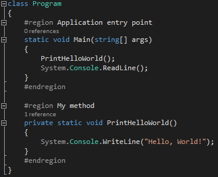
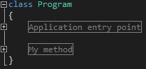
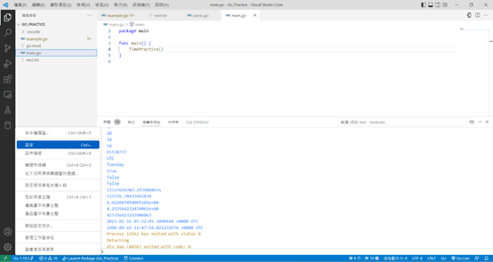
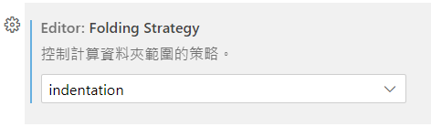
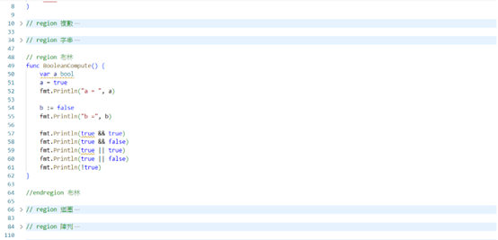

#程式語言教學與技術文件 #好用工具
# 修改 VS Code 設定檔來讓 Golang 有跟 C#一樣的 region 標籤縮放功能

使用 C#的時候，常常都會看到類似的標籤方式，可以讓某些功能匡列起來做縮放動作，也讓程式碼更容易讀，其實 Golang 在 VS Code 也有這種功能，首先，先來看看 C#是怎麼表現的：





主要就是在程式碼的某個區塊的開頭加上「#region 」，結尾加上「#endregion」，就可以將整個區塊作展開伸縮的動作，讓程式碼的每個區塊都更容易被分辨。

Golang 在 VS Code 也包含了這種功能，表示方式也是類似如此：

```go
//region Testing
    --> Coding Your Function
//endregion Testing
```

這樣就會有伸縮的功能，但 VSCode 預設是不會幫 Golang 做這件事的，記得去設定更改下面的設定，這樣做才可以使用

- 點開 VS Code 的設定



- 在搜尋欄搜尋「editor.foldingStrategy」


- 把這個設定改為「indentation」保存即可。



最後，給一下使用的效果：



