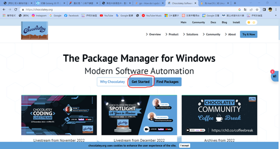
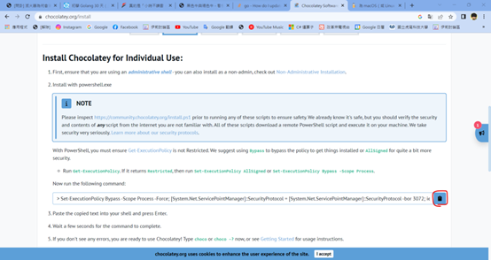
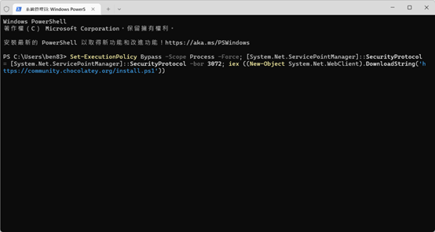

#程式語言教學與技術文件 #好用工具
# 好用的 Windows 套件管理工具 -- Chocolatey

<font style="background: #f9ecd7">這個套件管理程式無論在 Mingw、Flutter、ASP.NET，甚至是 Google Chrome 都可以拿來做使用，只是剛好 golang 拿來升級很方便所以拿來這裡寫(還有 Adobe PDF Reader)</font>

### 什麼是 Chocolatey?

大家如果有常常用 Linux 跟 MacOS，應該都知道他們有所謂的「套件管理程式」，簡單來說在 Linux 的 Ubuntu(Debian 系列)就是 Apt 套件管理，Fedora(RedHat 系列)就是 dnf，也有其他 Linux 使用的是 yum，常常在更新套件跟系統時都會用到這樣的 Command：

```bash
    sudo apt-get update
    sudo apt-get upgrade
    sudo apt-get install <package>
```

&nbsp;
這樣可以讓大家更加方便的去安裝、升級一些基礎的套件，也因為 MacOS 跟 Linux 都採用 bash 作為他們的終端，操作方式可以說是完全相同。故也有第三方做了給 MacOS 的套件管理程式，則稱為 Homebrew。
&nbsp;
Homebrew 說明：[https://zh.wikipedia.org/zh-tw/Homebrew](https://zh.wikipedia.org/zh-tw/Homebrew)
Homebrew 官網：[https://brew.sh/index_zh-tw](https://brew.sh/index_zh-tw)
比較特別的是，Homebrew 在 linux 上也可以跑，一般在使用指令是這樣的：

```bash
brew install package
```

因為不常使用 MacOS，所以無法針對這部分說明太多，那，難道 Windows 沒有這樣的東西嗎?

有，只是不常有人使用(可能是 Windows 在安裝套件上很方便所以不常有人用)，就是今天的主角 -- Chocolatey


這個就是 Chocolatey 的 icon

1. 先進入 Chocolatey 的官網，點選「Get Start」(網址：[https://chocolatey.org/](https://chocolatey.org/)

   &nbsp;
2. 會在下面找到安裝的 powershell 指令，點選右邊的複製按鈕複製指令

   &nbsp;
3. 打開 Windows 終端機或是 powershell，貼上指令執行安裝。

4. 安裝完後關閉終端機，重新用管理員再次開啟終端機上的 powershell。

5. 接下來初次使用 Chocolately，請先更新套件庫，指令如下：

```bash
>choco upgrade all
```

6. 他更新時會問你要不要更新，打 A 則是全部同意，Y 則是僅同意這個套件的更新，N 當然就是不要了，如果不想要全部更新，那就麻煩你一個一個打同意不同意了
7. 更新完後就可以使用了，之後的更新也都會是相同的指令，如果是安裝套件就是這樣：

```bash
>choco install package
```

言歸正傳，如果要安裝 Golang，直接這樣跑就可以

```bash
>choco install golang
```

更新的話，一樣用 upgrade all 就好了喔

注意事項與建議：

1. 因為很多安裝狀況都會用到最高權限，使用 choco 時只能在有系統管理員權限的 powershell 使用，不然不管更新還是安裝都一定會失敗

2. 如果有想要什麼套件不知道名稱安裝，Chocolatey 官網很貼心地在官網給了搜尋套件的功能，以及 GUI 的 Chocolatey 套件安裝程式，搜尋到照著他跑打就可以了喔

搜尋官網：[https://community.chocolatey.org/packages](https://community.chocolatey.org/packages)

Chocolately GUI 套件安裝程式：

```bash
choco install chocolateygui
```
