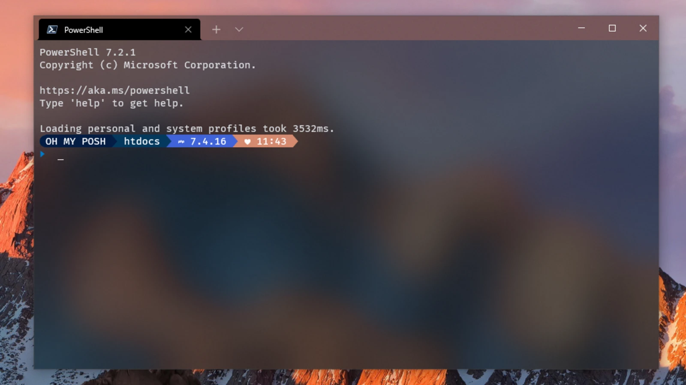

#程式語言教學與技術文件 #好用工具
# 終端機變漂亮 — oh-my-posh

應該很多人都有看過這種很漂亮的終端機介面吧：





oh-my-posh 可以幫你完成這樣的美夢，至於如何安裝可以參考官方教學：

[Oh-My-Posh 官網](https://ohmyposh.dev/ "https://ohmyposh.dev/")

目前我所使用的主題是 mojada，安裝指令如下：

```
oh-my-posh init pwsh --config https://raw.githubusercontent.com/JanDeDobbeleer/oh-my-posh/main/themes/mojada.omp.json | Invoke-Expression
```

## 關於其他設置

個人認為不太需要再使用 oh-my-posh 的 mojada ps1 了，而且可以用最新的 powershell，以避免辛苦的查找你要的指令：

(注意：不一定要用 winget，chocolatery 也能用喔)

```
winget search Microsoft.PowerShell
winget install --id Microsoft.Powershell --source winget
```

接下來用 winget 安裝 oh-my-posh：

```
winget install JanDeDobbeleer.OhMyPosh -s winget
```

安裝完畢後，先來設定以 oh-my-posh 來開啟你的 powershell：

```
oh-my-posh get shell => 先確定你當前的終端是pwsh(powershell)
notepad $PROFILE => 開啟起他的設定PROFILE
New-Item -Path $PROFILE -Type File -Force => 如果上述方式說PORFILE不存在，那就執行這條
```

接下來會用記事本開啟這個設定檔，先這樣設定：

```
oh-my-posh init pwsh | Invoke-Expression
```

設定儲存後，執行以下指令，看看你的 powershell 有沒有變成 oh-my-posh：

```
. $PROFILE
```

最後，如果你要安裝主題，可以先用這個指令來查找你喜歡的主題：

```
Get-PoshThemes
```

找到你喜歡的主題後，再次開啟你的 PORFILE 檔案，改成以下設定，例如我最常用的 mojada：

```
oh-my-posh init pwsh --config ~/mojada.omp.json | Invoke-Expression
```

也就是將 pwsh 加上 config，路徑就是~/xxxx.omp.json，如果不知道自己的主題，可以到 Get-PoshThemes 上面找到你喜歡的主題，針對主題 Ctrl+左鍵點選，就會跟你說他的本地位置與名稱。
