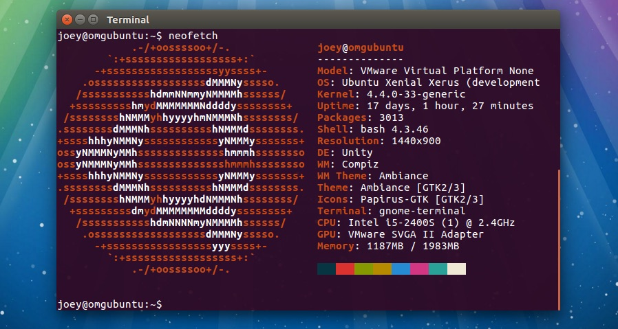
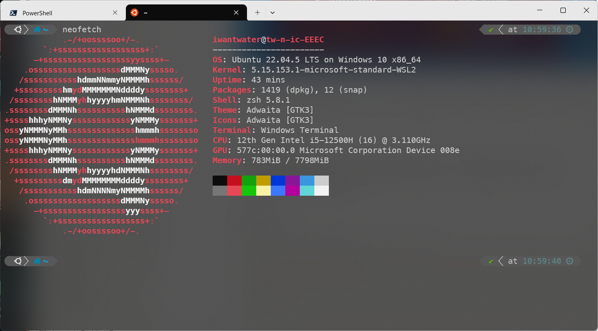
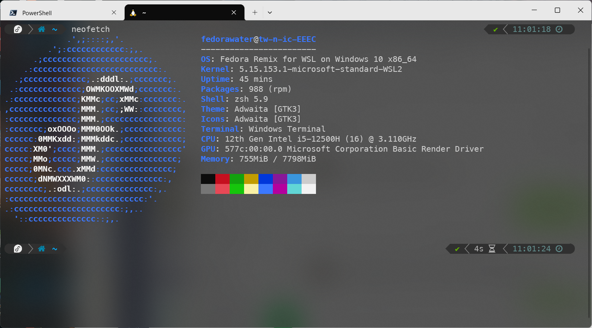
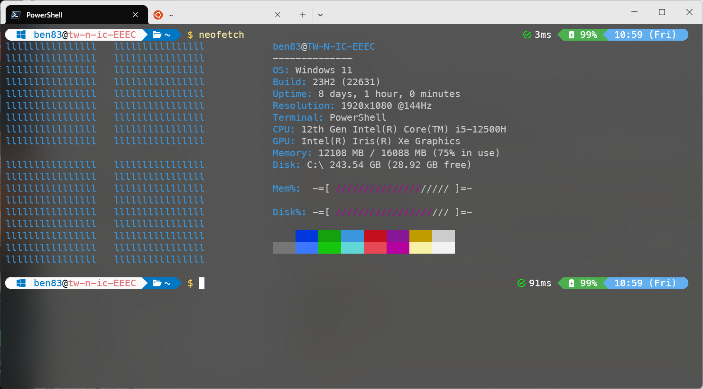
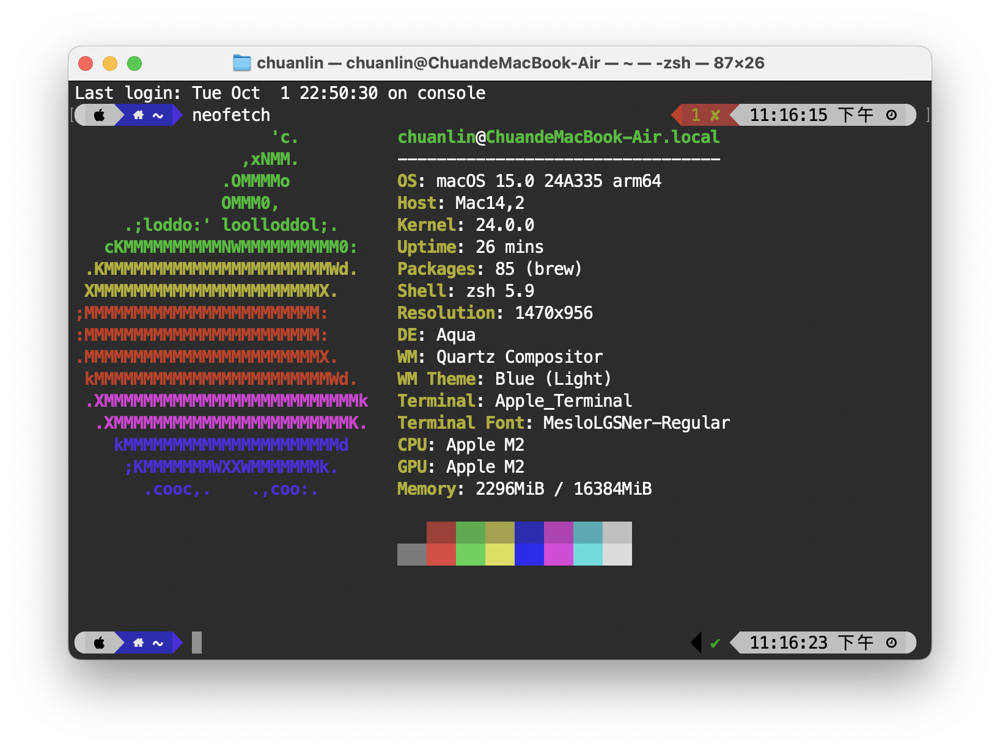

#程式語言教學與技術文件 #好用工具
# 美麗的終端系統資訊顯示—neofetch

有時候是否羨慕有些外國開發者在終端機上都會出現這種美麗的系統資訊呢?




嘿嘿~現在就教你怎麼擁有他! 他可是三大平台都有的喔!先來教怎麼安裝跟怎麼讓他一開終端機就有~~

## Linux 平台

Linux 平台的安裝是最簡單的，因為 neofetch 就是他開始的，我分別說明 Ubutnu(Debian)跟 Fedora(RedHat)的兩種安裝教法：

### Ubuntu




```bash
sudo apt-get install neofetch

#執行
neofetch
```

### Fedora





```bash
sudo dnf install neofetch

#執行
neofetch
```

如果想要開終端機就可以直接執行一次 Neofetch，可以這樣做，本部分使用 zsh 的.zshrc 做示範，我想 bash 應該也可以大致使用。

```bash
if [[ $- == *i* ]]; then
    neofetch
fi
```

## Windows 平台




沒想到 Windows 平台也有 neofetch吧~ 要安裝 Windows 的 neofetch 也是很簡單的，只要去這個網址下載或是執行 winget 就能擁有。

網址：[https://github.com/nepnep39/neofetch-win/releases](https://github.com/nepnep39/neofetch-win/releases)

Winget:

```bash
winget install neofetch
```

如果想要開終端機就可以直接執行一次 Neofetch，可以這樣做，僅限 Powershell 喔~

```bash
notepad $PROFILE
#加入這段============
neofetch
#====================
#載入
. $PROFILE
```

## Mac 平台




Mac 也會有 neofetch，想當然就用的就是 homebrew 了，至於如何安裝 homebrew 就自己查拉~很簡單的

```bash
brew install neofetch
```
